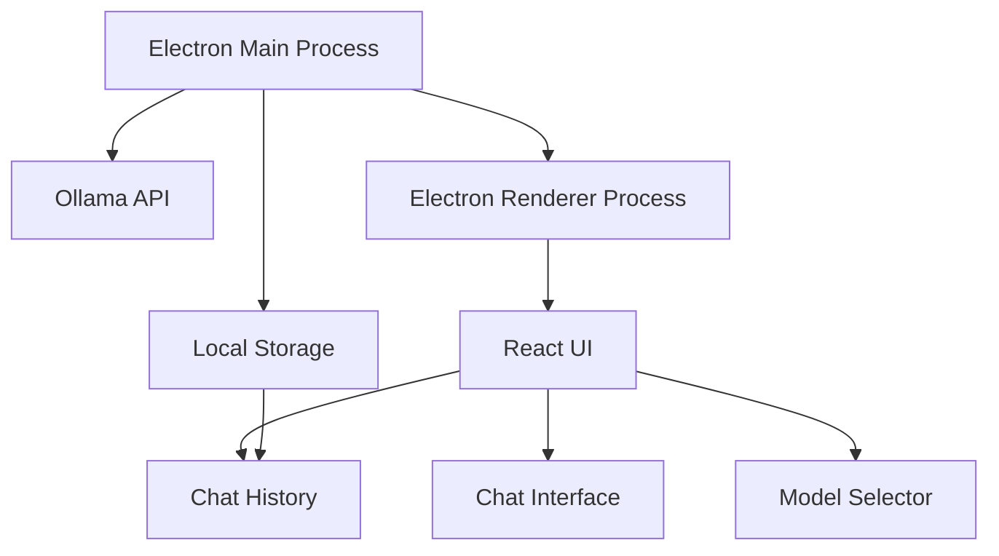

# Local Chat - Ollama Desktop Client

A native macOS desktop application for chatting with your local Ollama models. Built with Electron and React, this application provides a clean, modern interface for interacting with AI models running on your machine.

## Features

### Model Management ✅
- List and select from available local models
- View detailed model information (parameters, quantization, size)
- Seamless model switching
- Real-time model status monitoring

### Chat Interface ✅
- Clean, modern design optimized for AI conversations
- Real-time message streaming with live markdown preview
- Advanced markdown rendering with GitHub Flavored Markdown
- Syntax highlighting for code blocks with language detection
- Multi-line input with auto-resize
- Clear loading and error states
- Dark mode support

### Chat History (Coming Soon)
- Persistent conversation storage
- Browse and search past conversations
- Delete or export conversations
- Conversation organization

### System Integration (In Progress)
- Native macOS application
- Dock icon and system tray presence
- Application menu integration
- Window management
- System notifications

## Architecture



## Tech Stack

- **Electron**: Desktop application framework
- **React**: UI framework
- **TypeScript**: Type-safe development
- **Vite**: Build tool and development server
- **TailwindCSS**: Styling with typography plugin
- **SQLite**: Local storage (coming soon)
- **React Markdown**: Message rendering with GFM support
- **Axios**: API communication with streaming support

## Development Setup

1. Prerequisites:
   - Node.js (v18 or later)
   - npm (v9 or later)
   - [Ollama](https://ollama.ai) installed and running locally

2. Installation:
   ```bash
   # Clone the repository
   git clone https://github.com/trevadelman/local-chat.git
   cd local-chat
   
   # Install dependencies
   npm install
   
   # Start development server
   npm run electron:dev
   ```

3. Development Commands:
   ```bash
   # Start development server
   npm run electron:dev
   
   # Build the application
   npm run build
   
   # Package for distribution
   npm run electron:build
   
   # Lint code
   npm run lint
   
   # Format code
   npm run format
   
   # Type check
   npm run type-check
   ```

## Project Structure

```
local-chat/
├── src/
│   └── renderer/          # React application
│       ├── components/    # UI components
│       ├── types/        # TypeScript types
│       └── main.tsx      # React entry point
├── electron/             # Electron configuration
│   ├── main.mjs         # Main process
│   └── preload.cjs      # Preload script
├── public/              # Static assets
└── package.json        # Project configuration
```

## Current Status

- ✅ Basic project setup and configuration
- ✅ Electron main process with IPC communication
- ✅ React application structure with TypeScript
- ✅ Ollama API integration with streaming support
- ✅ Chat interface with markdown and code highlighting
- ✅ Model management and switching
- ✅ Dark mode support
- 🚧 Chat history and persistence
- 🚧 System integration features
- 📋 Testing and documentation

## Contributing

Contributions are welcome! Please feel free to submit a Pull Request.

## License

MIT License - feel free to use this code for any purpose.
