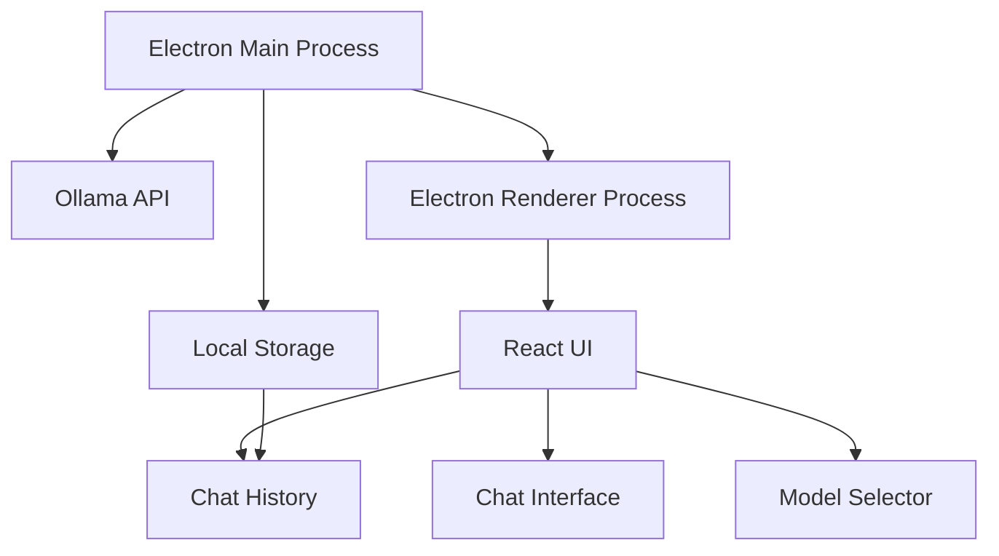

# Local Chat - Ollama Desktop Client

A native macOS desktop application for chatting with your local Ollama models. Built with Electron and React, this application provides a clean, modern interface for interacting with AI models running on your machine.

## Features

### Model Management
- List and select from available local models
- View detailed model information
- Seamless model switching
- Real-time model status monitoring

### Chat Interface
- Clean, modern design optimized for AI conversations
- Real-time message streaming
- Markdown rendering support
- Syntax highlighting for code blocks
- Clear loading and error states
- System message customization

### Chat History
- Persistent conversation storage
- Browse and search past conversations
- Delete or export conversations
- Conversation organization

### System Integration
- Native macOS application
- Dock icon and system tray presence
- Application menu integration
- Window management
- System notifications

## Architecture



## Tech Stack

- **Electron**: Desktop application framework
- **React**: UI framework
- **TailwindCSS**: Styling
- **SQLite**: Local storage
- **React Query**: API state management
- **CodeMirror**: Code syntax highlighting
- **React Markdown**: Message rendering

## Development Setup

1. Prerequisites:
   - Node.js (v18 or later)
   - npm or yarn
   - Ollama installed and running locally

2. Installation:
   ```bash
   # Install dependencies
   npm install
   
   # Start development server
   npm run dev
   ```

3. Building:
   ```bash
   # Build for production
   npm run build
   
   # Package application
   npm run package
   ```

## Project Structure

```
local-chat/
├── src/
│   ├── main/              # Electron main process
│   │   ├── index.ts       # Main entry point
│   │   └── preload.ts     # Preload script
│   ├── renderer/          # React application
│   │   ├── components/    # UI components
│   │   ├── hooks/         # Custom hooks
│   │   ├── services/      # API services
│   │   └── store/         # State management
│   └── shared/            # Shared types and utilities
├── public/               # Static assets
├── electron/             # Electron configuration
└── package.json         # Project configuration
```

## Contributing

Contributions are welcome! Please feel free to submit a Pull Request.

## License

MIT License - feel free to use this code for any purpose.
