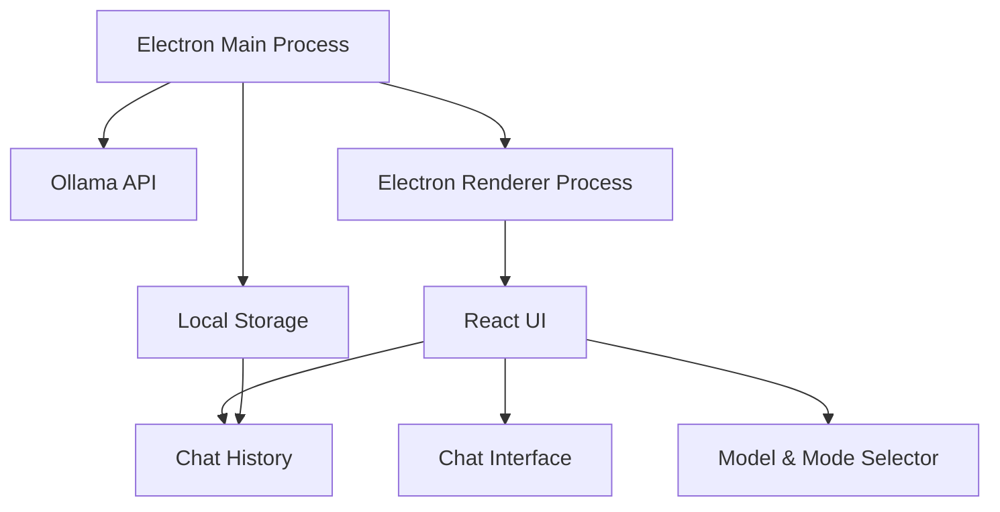

# Local Chat - Ollama Desktop Client

A native macOS desktop application for chatting with your local Ollama models. Built with Electron and React, this application provides a clean, modern interface for interacting with AI models running on your machine.


## Quick Start

See [SETUP.md](SETUP.md) for detailed instructions on:
- Development setup
- Building for distribution
- Installing the built app
- Troubleshooting common issues

## Features

### Model Management ✅
- List and select from available local models with detailed cards
- View model information (parameters, quantization, size)
- Seamless model switching with persistent preferences
- Real-time model status monitoring
- Default model selection

### Response Modes ✅
- Concise: Brief, direct answers focusing on key points
- Normal: Balanced responses with explanations and examples
- Longform: Detailed analysis with comprehensive context
- Visual mode selection with descriptive cards
- Mode persistence across conversations

### Chat Interface ✅
- Clean, modern design optimized for AI conversations
- Real-time message streaming with live markdown preview
- Advanced markdown rendering with GitHub Flavored Markdown
- Syntax highlighting for code blocks with language detection
- Multi-line input with auto-resize
- Clear loading and error states
- Dark mode support
- Collapsible reasoning sections for models that expose their thought process
- Token counter with context window tracking
- Visual indicators for token usage thresholds

### Token Counter
The token counter helps you track your usage of the model's context window:

```
[🧮] 1,234 / 4,096 tokens (30%) [▓▓░░░░░░░░] 🔵 500 🟣 734
```

- Total tokens / Context window size with percentage
- Visual progress bar that changes color based on usage:
  - Green: < 75% used
  - Yellow: 75-90% used
  - Red: > 90% used
- 🔵 Prompt tokens (your input + conversation history)
- 🟣 Response tokens (model's output)

The context window size is automatically determined based on the model:
- 4,096 tokens for 7B models
- 8,192 tokens for larger models

### Chat History ✅
- Persistent conversation storage with SQLite
- Browse and manage conversation history
- Delete conversations
- Automatic conversation creation and organization
- Real-time message syncing
- Smart conversation titles generated from first message

### System Integration (In Progress)
- Native macOS application
- Dock icon and system tray presence
- Application menu integration
- Window management
- System notifications

## Architecture



## Tech Stack

- **Electron**: Desktop application framework
- **React**: UI framework
- **TypeScript**: Type-safe development
- **Vite**: Build tool and development server
- **TailwindCSS**: Styling with typography plugin
- **SQLite**: Local storage
- **React Markdown**: Message rendering with GFM support
- **Axios**: API communication with streaming support


## Project Structure

```
local-chat/
├── src/
│   └── renderer/          # React application
│       ├── components/    # UI components
│       ├── types/        # TypeScript types
│       └── main.tsx      # React entry point
├── electron/             # Electron configuration
│   ├── main.mjs         # Main process
│   └── preload.cjs      # Preload script
├── public/              # Static assets
└── package.json        # Project configuration
```

## Current Status

- ✅ Basic project setup and configuration
- ✅ Electron main process with IPC communication
- ✅ React application structure with TypeScript
- ✅ Ollama API integration with streaming support
- ✅ Chat interface with markdown and code highlighting
- ✅ Model management and switching
- ✅ Response mode selection
- ✅ Dark mode support
- ✅ Chat history and persistence
- 🚧 System integration features
- 📋 Testing and documentation

## Contributing

Contributions are welcome! Please feel free to submit a Pull Request. See [SETUP.md](SETUP.md) for development instructions.

## License

MIT License - feel free to use this code for any purpose.
